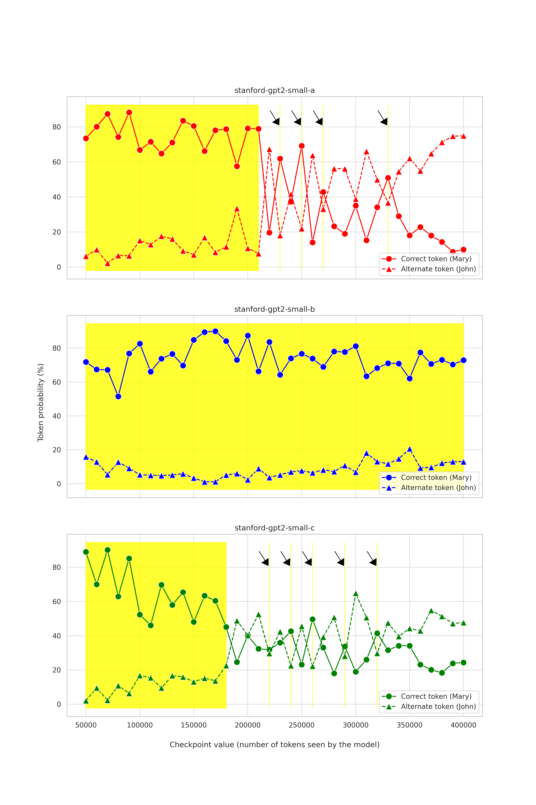

# mech-interpretability

This repo contains my experiments to better understand the recent advances in mechanistic interpretability research (with an emphasis on characterizing the stability of discovered circuits). Please see the [drafts](./drafts/draft_v1_nov10_2023.pdf) summarizing the findings.

### Exploring length generalization in the context of indirect object identification task

**Abstract**

Mechanistic interpretability aims to explain how neural networks learn at the circuit level. So far only a handful of circuits with compelling evidence have been discovered in relatively small language models [1,2,3]. It remains unclear whether these circuits (a) persist once formed after training further, and (b) have similar explanatory power in larger models or models with different architecture. A recent case study on reverse engineering the circuit behind indirect object identification (IOI) task has uncovered an interesting circuit with a fairly specialized division of labor [3]. While the authors performed extensive experiments and ablation analyses to validate the specific circuit components (i.e., specialized attention heads), how the model performance varies under different perturbations is underexplored. Here we study the performance on IOI task and its variants in the original GPT-2 small and other models of equivalent size. This analysis makes some progress toward addressing the following open research questions curated by Neel Nanda: 5.34 and 5.35 [4].

### References

1. Nelson Elhage, Neel Nanda, Catherine Olsson et al. A mathematical framework for transformer circuits. [Transformer Circuits Thread](https://transformer-circuits.pub/2021/framework/index.html) (2021)
2. Nanda, Neel, et al. "Progress measures for grokking via mechanistic interpretability." [arXiv:2301.05217](https://arxiv.org/abs/2301.05217) (2023)
3. Wang, Kevin, et al. "Interpretability in the wild: a circuit for indirect object identification in gpt-2 small." [arXiv:2211.00593](https://arxiv.org/abs/2211.00593) (2022)
4. [200 Concrete Problems in Interpretability](https://docs.google.com/spreadsheets/d/1oOdrQ80jDK-aGn-EVdDt3dg65GhmzrvBWzJ6MUZB8n4/edit#gid=0)
5. [TransformerLens library](https://github.com/neelnanda-io/TransformerLens) 
